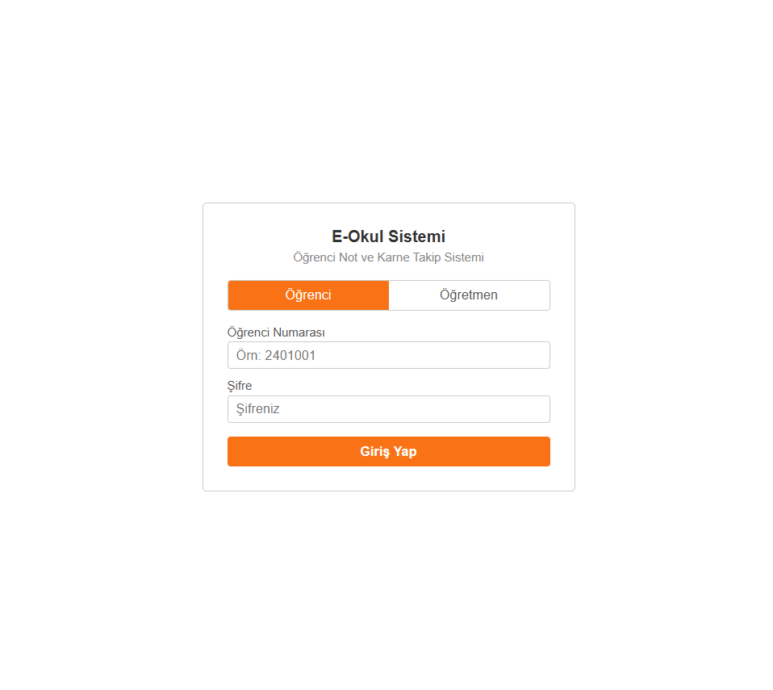
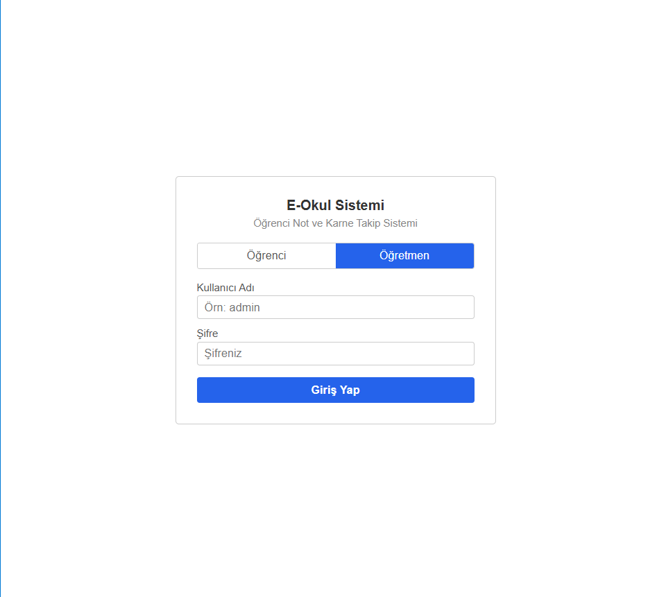
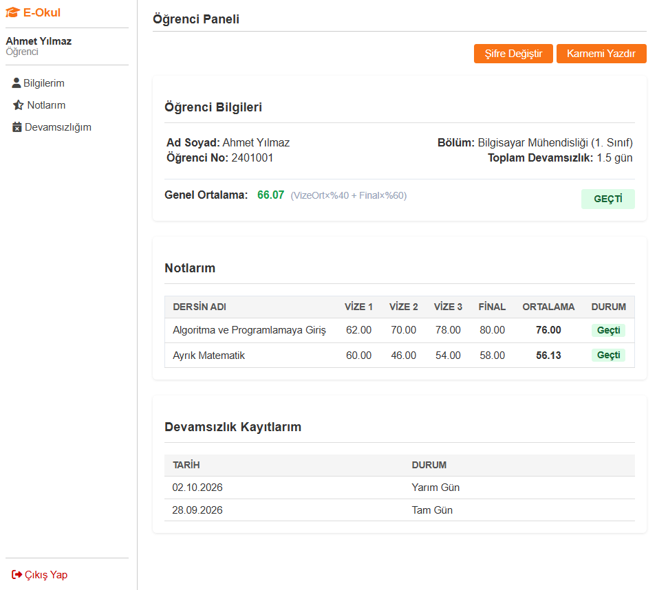
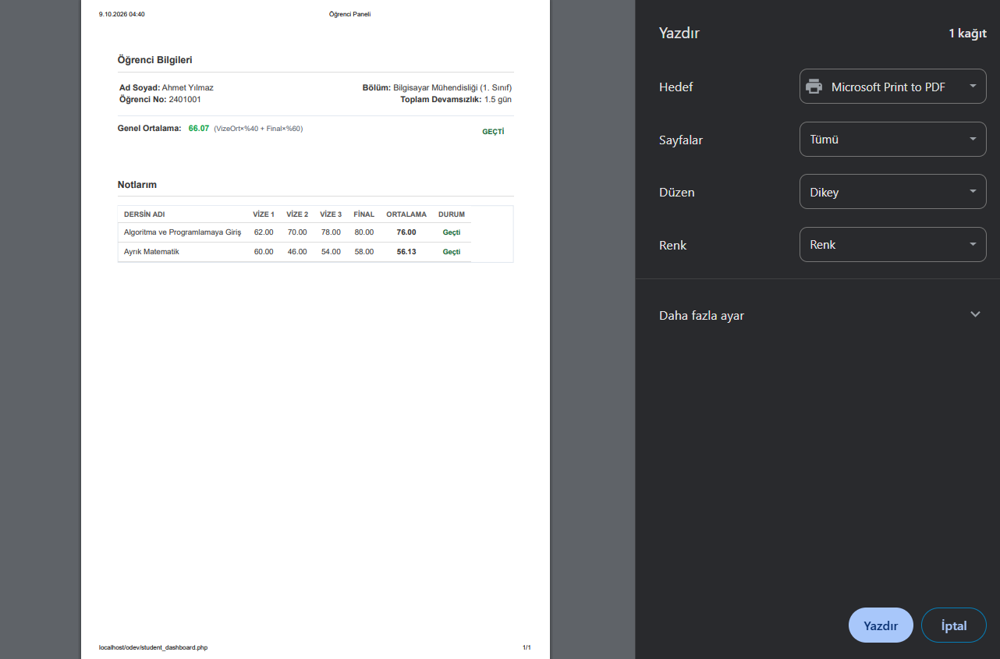
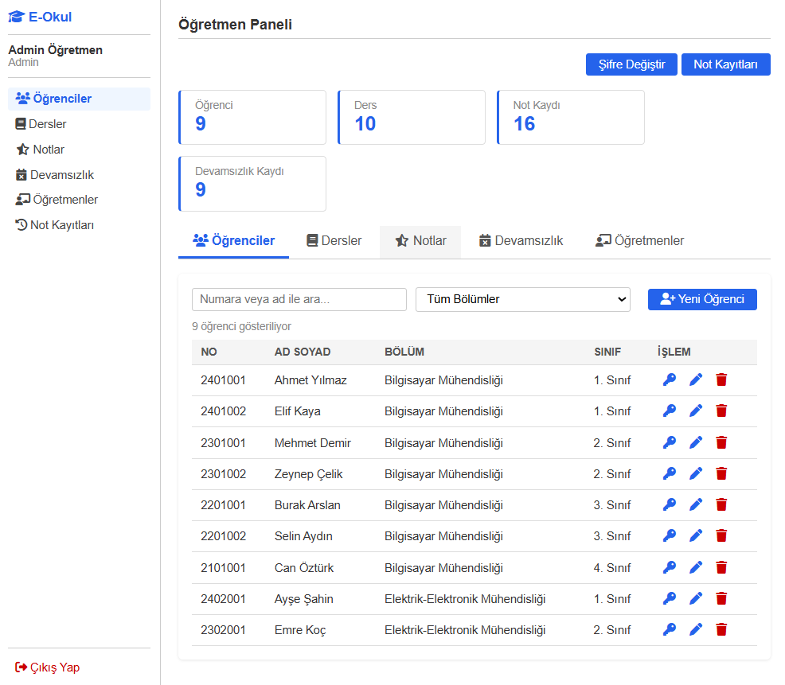
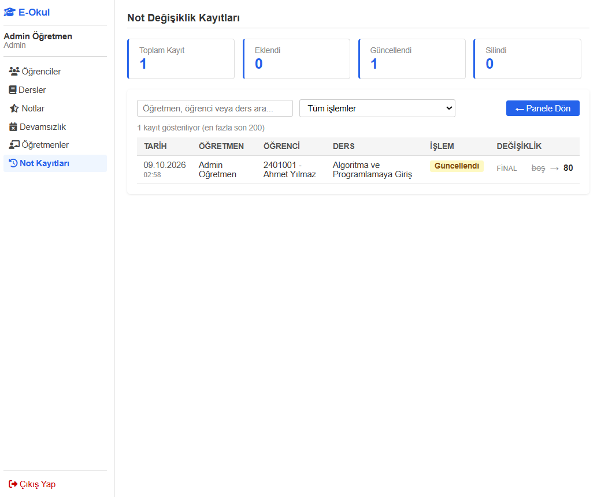
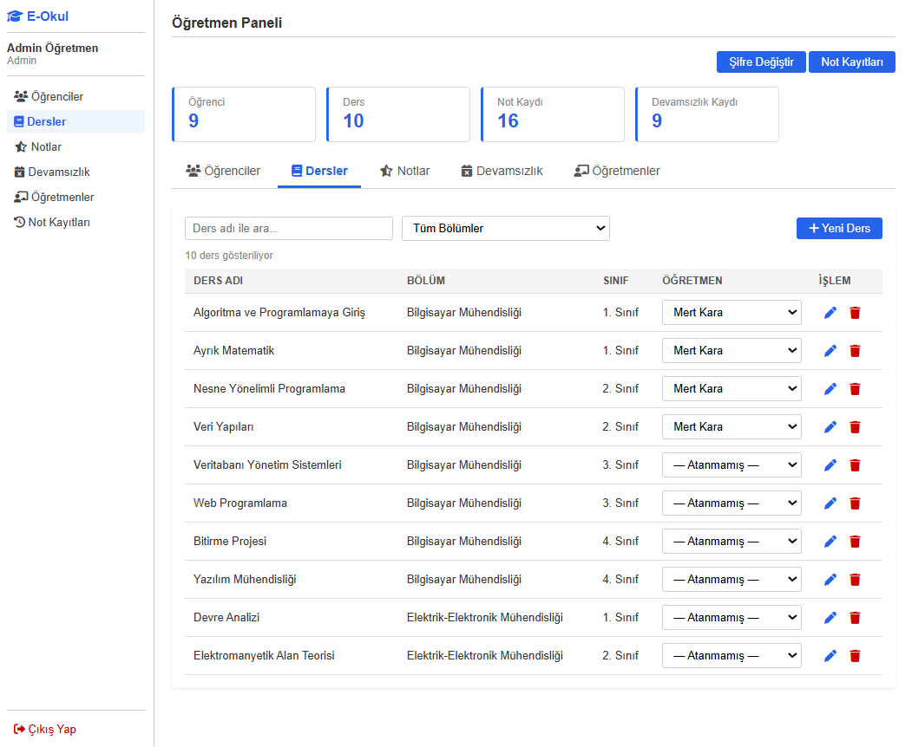
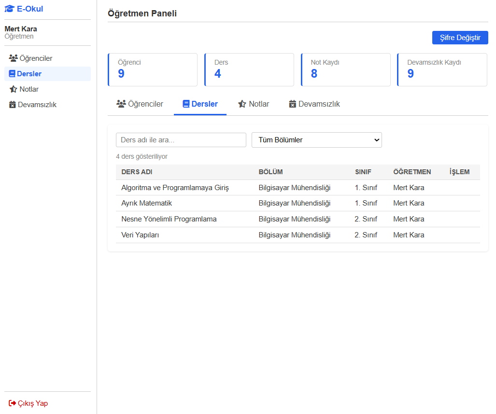

# E-Okul Sistemi

PHP ve MySQL ile geliştirilmiş, öğrenci not ve karne takip sistemi. Öğrenciler notlarını, genel ortalamalarını ve devamsızlıklarını görüntüleyip karnelerini yazdırabilir. Öğretmenler ve yöneticiler ise öğrenci, ders, not ve devamsızlık kayıtlarını rol bazlı yetkilerle yönetir.

## Ekran Görüntüleri

### Giriş

Öğrenci ve öğretmen girişi ayrı sekmelerden yapılır.

| Öğrenci Girişi | Öğretmen Girişi |
|---|---|
|  |  |

### Öğrenci Paneli

Öğrenci bilgileri, ders bazlı notlar, genel ortalama, geçti/kaldı durumu ve devamsızlık kayıtları tek sayfada görüntülenir.



**Karne çıktısı:** "Karnemi Yazdır" butonu menü ve devamsızlık tablosunu gizleyerek sadece karne bilgilerini yazdırır.



### Admin Paneli

Admin; öğrenci, ders, öğretmen, not ve devamsızlık yönetiminin tamamına erişir.







### Öğretmen Paneli

Normal öğretmen yalnızca kendisine atanan derslerin notlarını, devamsızlığını görür ve yönetir.



## Özellikler

**Öğrenci**
- Ders bazlı vize, final ve ortalama görüntüleme
- Genel ortalama ve geçti/kaldı durumu
- Devamsızlık takibi (tam gün / yarım gün)
- Yazdırmaya uygun karne çıktısı
- Şifre değiştirme

**Öğretmen**
- Sadece kendisine atanan derslere not girme, düzenleme ve silme
- Devamsızlık girişi
- Arama ve bölüm filtreleri

**Admin**
- Öğrenci, ders ve öğretmen ekleme / düzenleme / silme
- Derslere öğretmen atama
- Öğrenci ve öğretmen şifrelerini sıfırlama
- Tüm not değişikliklerinin kayıt altına alındığı **Not Kayıtları** ekranı (kim, ne zaman, hangi notu değiştirdi)

## Not Hesaplama

```
Ortalama = (Vize ortalaması × 0.40) + (Final × 0.60)
```

- Vize ortalaması, girilmiş olan vizelerin ortalamasıdır (en fazla 3 vize).
- Ortalama, vize ve final birlikte girildiğinde hesaplanır.
- Ortalaması 50 ve üzeri olan ders "Geçti", altı "Kaldı" olarak gösterilir.

## Güvenlik

- Şifreler `password_hash` (bcrypt) ile saklanır
- Tüm SQL sorguları PDO prepared statement ile çalışır
- Tüm formlarda CSRF token doğrulaması
- Hatalı girişlerde IP bazlı kısıtlama (15 dakikada 5 deneme)
- Girişte oturum kimliği yenilenir (session fixation koruması)
- Her istekte kullanıcının hâlâ var olduğu ve rolü kontrol edilir
- Yetki kontrolleri sunucu tarafında yapılır; öğretmen, atanmadığı dersin notlarına erişemez
- Çıktılar `htmlspecialchars` ile kaçışlanır (XSS koruması)

## Kullanılan Teknolojiler

- PHP 8
- MySQL / MariaDB (PDO)
- HTML, CSS, JavaScript
- Font Awesome

## Kurulum

1. Projeyi indirin veya klonlayın.
2. phpMyAdmin'de `php_odev` adında boş bir veritabanı oluşturun.
3. `database.sql` dosyasını bu veritabanına içe aktarın.
4. `config.example.php` dosyasını `config.php` olarak kopyalayın ve veritabanı bilgilerinizi düzenleyin.
5. Proje klasöründe sunucuyu başlatın:

   ```bash
   php -S localhost:8080
   ```

6. Tarayıcıda `http://localhost:8080` adresini açın.

XAMPP kullanıyorsanız projeyi `htdocs` altına koyup `config.php` içindeki `SITE_URL` değerini kendi adresinize göre güncelleyin.

## Demo Hesaplar

Tüm demo hesapların şifresi: `123456`

| Rol | Kullanıcı | Açıklama |
|---|---|---|
| Admin | `admin` | Tüm yetkiler |
| Öğretmen | `ogretmen1` | Sadece kendisine atanan dersler |
| Öğrenci | `2401001` | Öğrenci numarası ile giriş |

> Gerçek bir ortamda kullanmadan önce demo şifrelerini mutlaka değiştirin.

## Proje Yapısı

```
├── index.php               # Giriş sayfası
├── login_process.php       # Giriş işlemi, deneme sınırı
├── logout.php
├── auth.php                # Oturum, yetki, CSRF ve log fonksiyonları
├── config.php              # Veritabanı ayarları (git'e eklenmez)
├── config.example.php      # Örnek ayar dosyası
├── database.sql            # Tablolar ve örnek veriler
├── student_dashboard.php   # Öğrenci paneli ve karne
├── teacher_dashboard.php   # Öğretmen / admin paneli
├── teacher_actions.php     # Panel POST işlemleri
├── not_log.php             # Not değişiklik kayıtları (admin)
├── change_password.php
├── includes/               # Ortak header / footer
├── assets/
│   ├── css/                # style.css, teacher.css
│   └── js/                 # main.js, teacher.js
└── screenshots/       # README görselleri
```